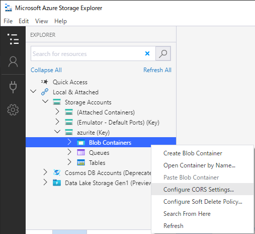
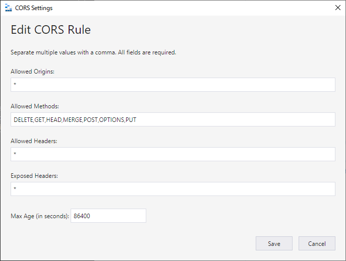
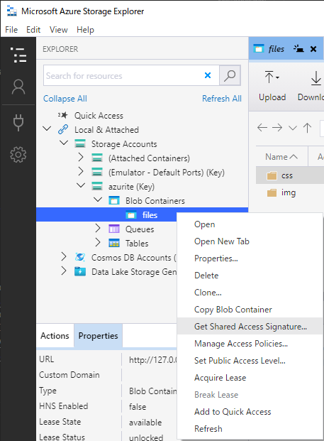
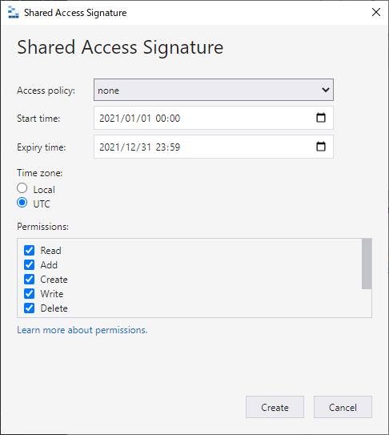
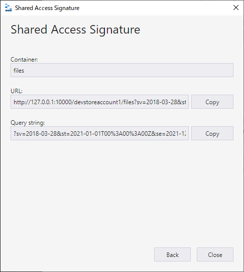

# Azure Blob Filer

This application is a filer for Blob containers created with Vue.js.  
Only Blob items inside a Blob container can be updated.  
You need to have a SAS URL for the Azure Blob Container.  
Before your web application can access blob storage from the client, you must configure your account to enable cross-origin resource sharing, or CORS.  

### Demo
https://watertrans.github.io/AzureBlobFiler/

### Screenshot


## Features

- Uploading files directly to the Azure Blob Container to be fast and efficient.
- Not possible to add or remove the default Blob container.
- Displays the contents of the Blob container in an explorer-like tree view.
- Specify a folder to upload all files.
- Specify multiple files to upload.
- Unzip the specified ZIP file and upload it.

## Limitations

- There is no function to display the contents of the file.
- There is no function to move files.
- To create that folder, we will generate a hidden file called ".keep".
- It has been tested with the latest versions of Chrome, FireFox, and Edge.

## Prerequisites

- Node.js
- Vue CLI
- Visual Studio Code
- Visual Studio Code Extensions
  - Prettier - Prettier
  - ESLint - Dirk Baeumer
  - Sass - Syler
  - Vetur - Pine Wu
  - stylelint - stylelint

## Setup Azure Blob Storage

### CORS

1. Open the CORS configuration screen of the storage account where you created the Blob container.
2. Set this according to the execution environment of the application. For more information, check out this [article](https://docs.microsoft.com/en-us/azure/storage/blobs/quickstart-blobs-javascript-browser#create-a-cors-rule).
   

### SAS URL

1. Create a Blob container of any name in Azure Portal.
2. Generate SAS URL.
   
3. Set the SAS URL to VUE_APP_SAS_URL in the following file. (Option)
    - ``\src\azure-blob-filer\.env.local``
      ```
      VUE_APP_SAS_URL={ENTER_THE_BLOB_SAS_URL_HERE}
      ```
    - Attention! Do not commit ``.env.local`` to Github.
    - If VUE_APP_SAS_URL is not set, an input dialog will be displayed at startup.

## Setup Azurite (free local environment for testing)

### Docker Compose

By default, Azurite applies strict mode to block unsupported request headers and parameters.  
Use the Loose mode. (azurite --loose)

```
version: '3.8'
services:
  db:
    image: mcr.microsoft.com/azure-storage/azurite
    container_name: azurite
    restart: always
    volumes: 
      - ./data:/data
    ports:
      - 10000:10000
      - 10001:10001
      - 10002:10002
    command: azurite --blobHost 0.0.0.0 --blobPort 10000 --queueHost 0.0.0.0 --queuePort 10001 --tableHost 0.0.0.0 --tablePort 10002 --loose
```

### CORS

1. Use Microsoft Azure Storage Explorer to connect to Azurite.
2. Right-click on Blob Containers and select "Configure CORS Settings...".
  
3. Set this according to the execution environment of the application. For more information, check out this [article](https://docs.microsoft.com/en-us/azure/storage/blobs/quickstart-blobs-javascript-browser#create-a-cors-rule).
  

### SAS URL

1. Create a Blob container of any name.  
2. Right-click on created blob container and select "Get Shared Access  Signature...".
  
3. For permissions, choice Read, Add, Create, Write, Delete, and List.  
  
4. Keep the URL field.  
  
5. Set the SAS URL to VUE_APP_SAS_URL in the following file. (Option)
    - ``\src\azure-blob-filer\.env.local``
      ```
      VUE_APP_SAS_URL={ENTER_THE_BLOB_SAS_URL_HERE}
      ```
    - Attention! Do not commit ``.env.local`` to Github.
    - If VUE_APP_SAS_URL is not set, an input dialog will be displayed at startup.