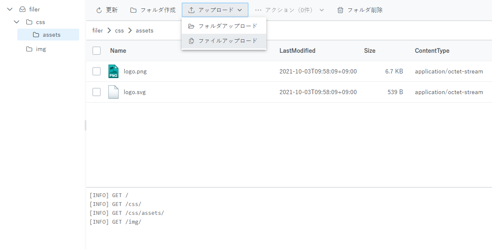
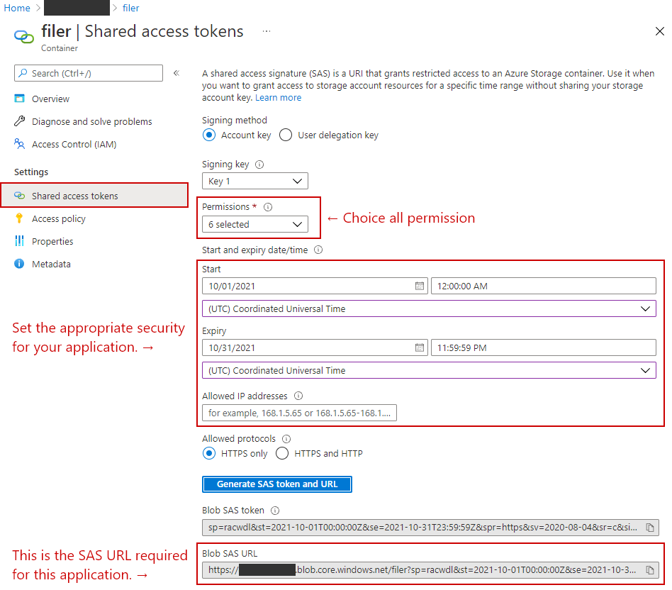
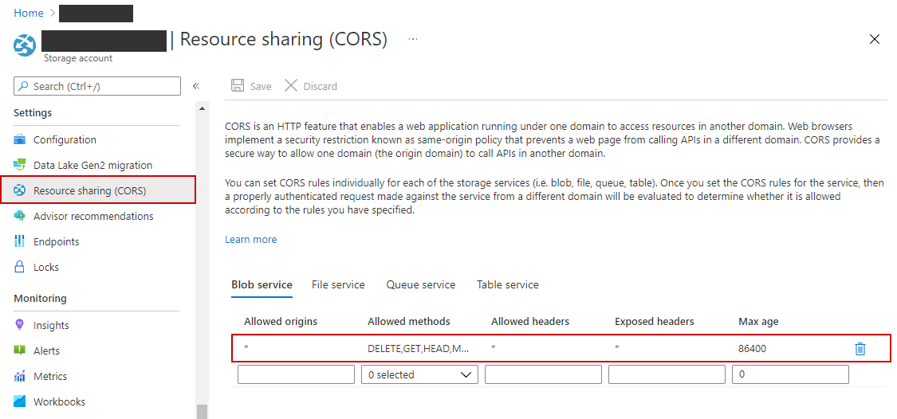

# Azure Blob Filer

This application is a filer for Blob containers created with Vue.js.  
Only Blob items inside a Blob container can be updated.  
You need to have a SAS URL for the Azure Blob Container.  



## Features

- Uploading files directly to the Azure Blob Container to be fast and efficient.
- Not possible to add or remove the default Blob container.
- Displays the contents of the Blob container in an explorer-like tree view.
- Specify a folder to upload all files.
- Specify multiple files to upload.

## Prerequisites

- Node.js
- Vue CLI
- Visual Studio Code
- Visual Studio Code Extensions
  - Prettier - Prettier
  - ESLint - Dirk Baeumer
  - Sass - Syler
  - Vetur - Pine Wu
  - stylelint - stylelint

## Setup SAS URL

1. Create a Blob container of any name in Azure Portal.
2. Generate SAS URL.
   
3. Set the SAS URL to VUE_APP_SAS_URL in the following file. (Option)
    - ``\src\azure-blob-filer\.env.local``
      ```
      VUE_APP_SAS_URL={ENTER_THE_BLOB_SAS_URL_HERE}
      ```
    - Attention! Do not commit ``.env.local`` to Github.
    - If VUE_APP_SAS_URL is not set, an input dialog will be displayed at startup.

## Setup CORS

1. Open the CORS configuration screen of the storage account where you created the Blob container.
2. Set this according to the execution environment of the application. For more information, check out this [article](https://docs.microsoft.com/en-us/azure/storage/blobs/quickstart-blobs-javascript-browser#create-a-cors-rule).
   

