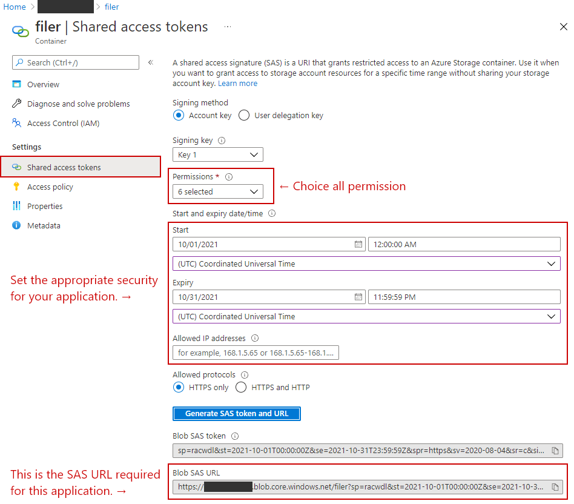
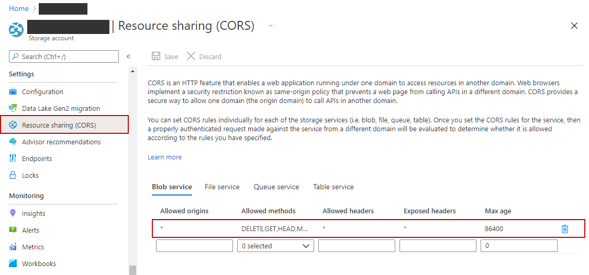

# Azure Blob Filer

This application is a serverless Azure Blob Filer that simplifies the functionality of Azure Storage Explorer.  
Only Blob items inside a Blob container can be updated.  
You need to have a SAS URL for the Azure Blob Container.  

## Prerequisites

- Node.js
- Vue CLI
- Visual Studio Code
- Visual Studio Code Extensions
  - Prettier - Prettier
  - ESLint - Dirk Baeumer
  - Sass - Syler
  - Vetur - Pine Wu
  - stylelint - stylelint

## Setup SAS URL

1. Create a Blob container of any name in Azure Portal.
2. Generate SAS URL.
   
3. Set the SAS URL to VUE_APP_SAS_URL in the following file.
    - ``\src\azure-blob-filer\.env.local``
      ```
      VUE_APP_SAS_URL={ENTERTHE_BLOB_SAS_URL_HERE}
      ```
    - Attention! Do not commit ``.env.local`` to Github.

## Setup CORS

1. Open the CORS configuration screen of the storage account where you created the Blob container.
2. Set this according to the execution environment of the application. For more information, check out this [article](https://docs.microsoft.com/en-us/azure/storage/blobs/quickstart-blobs-javascript-browser#create-a-cors-rule).
   

